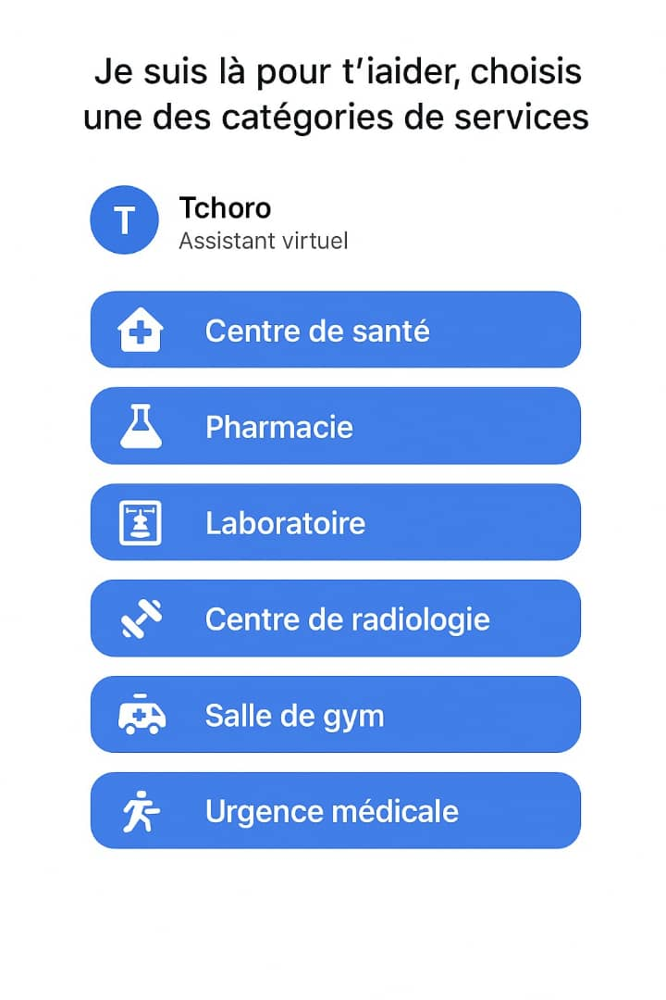
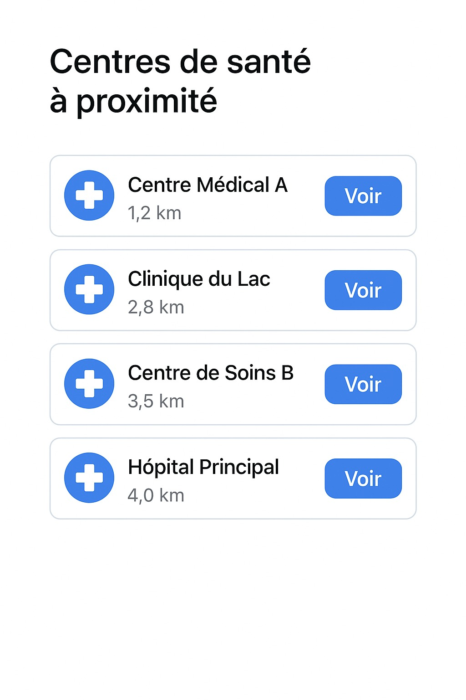
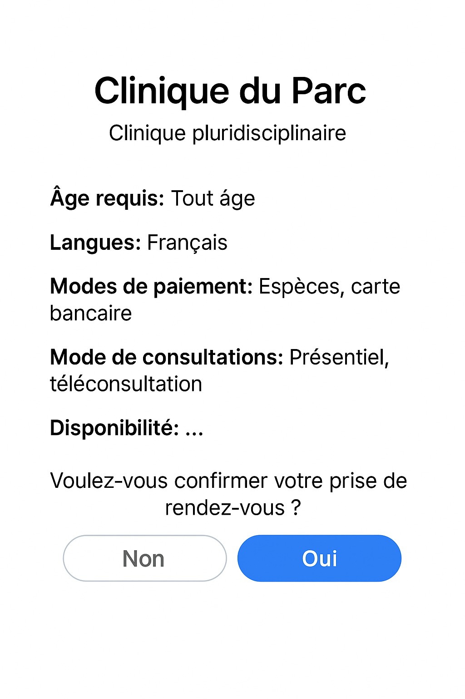
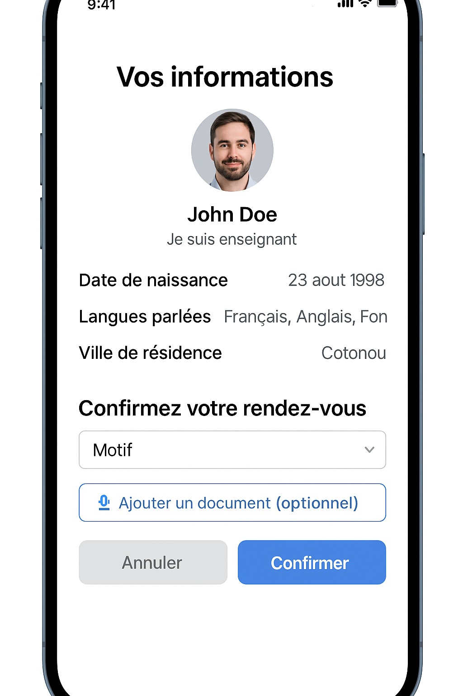

# API Bot Tcharo - Documentation pour les Développeurs Front-end

Bienvenue dans la documentation de l'API de Bot Tcharo ! Cette API permet aux applications front-end d'interagir avec la logique de prise de rendez-vous médicaux de Tchoro, en facilitant la navigation des utilisateurs à travers les catégories de services, la recherche de services par localisation, la consultation des détails de service, la visualisation des informations du patient, et la confirmation des rendez-vous.

## Table des matières

1.  [Prérequis](#1-prérequis)
2.  [Structure de l'API](#2-structure-de-lapi)
3.  [Endpoints de l'API](#4-endpoints-de-lapi)
    * [3.1. Récupérer les catégories de services](#41-récupérer-les-catégories-de-services)
    * [3.2. Récupérer les services de santé filtrés](#42-récupérer-les-services-de-santé-filtrés)
    * [3.3. Récupérer les détails d'un service de santé](#43-récupérer-les-détails-dun-service-de-santé)
    * [3.3. Récupérer les informations du patient](#44-récupérer-les-informations-du-patient)
    * [3.4. Confirmer un rendez-vous](#45-confirmer-un-rendez-vous)
    * [3.6. Endpoint WhatsApp Webhook](#46-endpoint-whatsapp-webhook)
    * [3.7. Endpoint Chat générique (non utilisé directement par le front-end actuel)](#47-endpoint-chat-générique-non-utilisé-directement-par-le-front-end-actuel)
4.  [Collection Postman](#5-collection-postman)

---

## 1. Prérequis

Avant de commencer l'integration de l'API, assurez-vous d'avoir l'adresse du Server et l'endpoint de l'API

## 2. Structure de l'API

Voici une vue simplifiée de l'architecture de l'API :

```

.
├── app.py                 
├── config.py              
├── requirements.txt     
├── bot/
│   ├── db.py             
│   ├── logic.py           
│   ├── logic2.py           
│   └── logic\_meta.py       
├── benincare.sql         
└── test\_connection.py     
````

## 3. Endpoints de l'API

Tous les endpoints acceptent des requêtes JSON dans le corps de la requête (pour les méthodes `POST`). Les réponses sont également au format JSON.

### Base URL

`https://194.164.77.56/tchoro/bot/api` (adresse de L'API)

---

### 3.1. Récupérer les catégories de services

Permet au front-end d'afficher les catégories de services disponibles pour que l'utilisateur puisse faire un choix initial.

* **Endpoint :** `/categories`
* **Méthode :** `GET`
* **Rôle :** Retourne les 6 premières catégories de services de santé.
* **CORS :** Autorisé pour toutes les origines (`*`).

#### Capture d'écran Front-end Correspondante



#### Requête Exemple (GET)

```http
GET /categories HTTP/1.1
Host: https://194.164.77.56/tchoro/bot/api
````

#### Réponse Attendue (Succès - 200 OK)

```json
{
    "message": "Voici les 6 premières catégories de services disponibles :",
    "categories": [
        {"id": 1, "name": "Centre de santé"},
        {"id": 2, "name": "Pharmacie"},
        {"id": 3, "name": "Laboratoire"},
        {"id": 4, "name": "Salle de gym"},
        {"id": 5, "name": "Centre de bien-être"},
        {"id": 6, "name": "Ambulances"}
    ]
}
```

-----

### 3.2. Récupérer les services de santé filtrés

Permet d'obtenir les services de santé pertinents pour un patient donné et une catégorie sélectionnée, en priorisant la ville du patient, puis sa région.

  * **Endpoint :** `/services`
  * **Méthode :** `POST`
  * **Rôle :** Retourne une liste de services de santé filtrés par `category_id` et par la `city_id` / `region_id` du patient. Indique si le service est dans la "Votre ville" ou "Votre région" au lieu de la distance.
  * **CORS :** Autorisé pour toutes les origines (`*`) et méthode `POST`.

#### Capture d'écran Front-end Correspondante


#### Requête Exemple (POST)

```http
POST /services HTTP/1.1
Host: https://194.164.77.56/tchoro/bot/api
Content-Type: application/json

{
    "user_id": 1,        // ID de l'utilisateur (patient)
    "category_id": 1     // ID de la catégorie de 
}
```

#### Réponse Attendue (Succès - 200 OK)

```json
{
    "message": "Voici les services disponibles pour la catégorie sélectionnée, près de Koffi :",
    "services": [
        {
            "id": 1,
            "name": "CNHU-HKM Cotonou",
            "location_type": "Votre ville",
            "category_id": 1,
            "city_id": 1,
            "city_name": "Cotonou"
        },
        {
            "id": 7,
            "name": "Centre de Diagnostic de Porto-Novo",
            "location_type": "Votre région",
            "category_id": 1,
            "city_id": 5,
            "city_name": "Porto-Novo"
        }
        // ... Jusqu'à 6 services
    ]
}
```

#### Erreurs Possibles (400 Bad Request)

  * `{"message": "Paramètre 'user_id' manquant dans le corps de la requête."}`
  * `{"message": "Paramètre 'category_id' manquant dans le corps de la requête."}`
  * `{"message": "Les paramètres 'user_id' et 'category_id' doivent être des nombres entiers."}`
  * `{"message": "Aucun patient trouvé avec cet ID utilisateur."}`
  * `{"message": "Aucun service trouvé pour cette catégorie dans votre ville ni dans votre région.", "services": []}`

-----

### 3.3. Récupérer les détails d'un service de santé

Permet d'afficher les informations détaillées d'un service de santé spécifique avant de confirmer un rendez-vous.

  * **Endpoint :** `/service_details`
  * **Méthode :** `POST`
  * **Rôle :** Retourne les détails complets d'un service de santé (nom, type, langues parlées, modes de paiement, modes de consultation, disponibilité (simplifiée), description, et URL de la photo).
  * **CORS :** Autorisé pour toutes les origines (`*`) et méthode `POST`.

#### Capture d'écran Front-end Correspondante



#### Requête Exemple (POST)

```http
POST /service_details HTTP/1.1
Host: https://194.164.77.56/tchoro/bot/api
Content-Type: application/json

{
    "service_id": 1 // ID du service de santé sélectionné (ex: CNHU-HKM Cotonou)
}
```

#### Réponse Attendue (Succès - 200 OK)

```json
{
    "message": "Détails du service CNHU-HKM Cotonou :",
    "service_details": {
        "id": 1,
        "name": "CNHU-HKM Cotonou",
        "type": "Centre de santé",
        "age_required": "Tout âge",
        "languages": ["Français", "Fon"],
        "payment_modes": ["Espèces", "MoMo"],
        "consultation_modes": ["in_person", "teleconsultation"],
        "availability": "Disponible aujourd'hui: 08:00-18:00",
        "photo_url": "/path/to/cnhu_photo.jpg",
        "presentation": "Centre National Hospitalier Universitaire de référence avec des services variés."
    },
    "next_step": "confirm_appointment"
}
```

#### Erreurs Possibles (400 Bad Request)

  * `{"message": "Paramètre 'service_id' manquant dans le corps de la requête."}`
  * `{"message": "Le paramètre 'service_id' doit être un nombre entier."}`
  * `{"message": "Service de santé non trouvé."}`

-----

### 3.3. Récupérer les informations du patient

Utilisé pour afficher les informations du patient sur l'écran de confirmation du rendez-vous.

  * **Endpoint :** `/user_details`
  * **Méthode :** `POST`
  * **Rôle :** Retourne les informations du patient (nom complet, profession, date de naissance, langues, ville de résidence, photo de profil) pour validation.
  * **CORS :** Autorisé pour toutes les origines (`*`) et méthode `POST`.

#### Capture d'écran Front-end Correspondante



#### Requête Exemple (POST)

```http
POST /user_details HTTP/1.1
Host: https://194.164.77.56/tchoro/bot/api
Content-Type: application/json

{
    "user_id": 1 // ID de l'utilisateur (patient)
}
```

#### Réponse Attendue (Succès - 200 OK)

```json
{
    "message": "Voici vos informations pour la confirmation :",
    "user_details": {
        "user_id": 1,
        "full_name": "Koffi Doe",
        "profession": "Enseignant",
        "birth_date": "15 mai 1990",
        "languages": ["Fon", "Français"],
        "city_of_residence": "Cotonou",
        "profile_photo_url": "/path/to/koffi_photo.jpg"
    },
    "next_step": "confirm_appointment_details_input"
}
```

#### Erreurs Possibles (400 Bad Request)

  * `{"message": "Paramètre 'user_id' manquant dans le corps de la requête."}`
  * `{"message": "Le paramètre 'user_id' doit être un nombre entier."}`
  * `{"message": "Patient non trouvé avec cet ID utilisateur."}`

-----

### 3.4. Confirmer un rendez-vous

Endpoint pour créer un rendez-vous une fois que le patient a fourni toutes les informations nécessaires.

  * **Endpoint :** `/confirm_appointment`
  * **Méthode :** `POST`
  * **Rôle :** Enregistre un nouveau rendez-vous dans la base de données avec les détails fournis par le patient et le service. Le statut initial est `pending` et le paiement `unpaid`.
  * **CORS :** Autorisé pour toutes les origines (`*`) et méthode `POST`.

#### Requête Exemple (POST)

```http
POST /confirm_appointment HTTP/1.1
Host: https://194.164.77.56/tchoro/bot/api
Content-Type: application/json

{
    "user_id": 1,                  // ID de l'utilisateur (patient)
    "service_id": 1,               // ID du service de santé sélectionné
    "reason": "Consultation annuelle", // Motif du rendez-vous
    "consultation_mode": "in_person", // Mode de consultation (ex: "in_person", "teleconsultation")
    "appointment_date": "2025-06-10", // Date du rendez-vous (format YYYY-MM-DD)
    "start_time": "10:00:00",      // Heure de début (format HH:MM:SS)
    "end_time": "10:30:00",        // Heure de fin (format HH:MM:SS)
    "attachment_path": null        // Chemin vers un document joint (optionnel)
}
```

#### Réponse Attendue (Succès - 200 OK)

```json
{
    "message": "Parfait ! Votre rendez-vous chez CNHU-HKM Cotonou est en attente de validation. Nous vous contacterons bientôt pour confirmer.",
    "status": "pending",
    "appointment_details": {
        "service_name": "CNHU-HKM Cotonou",
        "date": "2025-06-10",
        "start_time": "10:00:00",
        "consultation_mode": "in_person",
        "reason": "Consultation annuelle"
    },
    "next_step": "end_conversation"
}
```

#### Erreurs Possibles (400 Bad Request)

  * `{"message": "Paramètres manquants : user_id, service_id, reason, consultation_mode, appointment_date, start_time, end_time sont requis."}`
  * `{"message": "Erreur de format de paramètre : invalid literal for int() with base 10: 'abc'. Assurez-vous que les IDs sont des entiers, la date est YYYY-MM-DD et les heures HH:MM:SS."}`
  * `{"message": "Patient non trouvé."}`
  * `{"message": "Service de santé non trouvé."}`

-----

### 3.6. Endpoint WhatsApp Webhook

  * **Endpoint :** `/whatsapp`
  * **Méthode :** `POST`
  * **Rôle :** Ce endpoint est destiné à recevoir les webhooks de l'API WhatsApp (Meta). Il traite les messages entrants de WhatsApp et utilise la logique du bot pour générer une réponse, puis l'envoie via l'API WhatsApp.
  * **Note pour le Front-end :** Ce endpoint n'est **pas** destiné à être appelé directement par l'application front-end de rendez-vous. Il est géré par l'intégration avec WhatsApp.

-----

### 3.7. Endpoint Chat générique (non utilisé directement par le front-end actuel)

  * **Endpoint :** `/chat`
  * **Méthode :** `POST`
  * **Rôle :** Il s'agit d'un endpoint générique de chatbot qui utilise la logique de conversation basée sur les étapes. Initialement conçu pour un bot plus linéaire, il est moins pertinent pour l'interface front-end actuelle qui utilise des endpoints spécifiques pour chaque action.
  * **Note pour le Front-end :** Ce endpoint n'est probablement **pas** celui que vous utiliserez directement pour les interactions spécifiques de catégories, services, etc., car des routes plus granulaires ont été créées (`/categories`, `/services`, etc.).

-----

## 5\. Collection Postman

Une collection Postman sera bientôt disponible pour faciliter le test de tous les endpoints de cette API.

**Lien vers la collection Postman :** `[En attentes d'initialisation]` 

-----

```
API TCHORO 
```